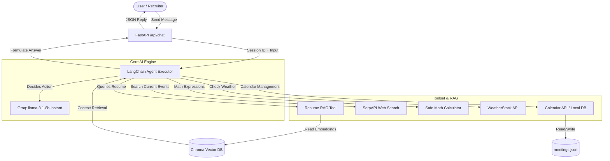

# 🤖 Krishna's AI Digital Twin: Technical Documentation & The Making

This document provides an in-depth explanation of the technical architecture, design choices, tool integrations, RAG pipeline, and development journey of the AI Digital Twin Chatbot.

---

## 📋 Table of Contents
1. [Project Overview & Problem Statement](#1-project-overview--problem-statement)
2. [Architecture & System Flow](#2-architecture--system-flow)
3. [The Core LLM & Framework](#3-the-core-llm--framework)
4. [Retrieval-Augmented Generation (RAG) Pipeline](#4-retrieval-augmented-generation-rag-pipeline)
5. [Agentic Workflows & Tools Breakdown](#5-agentic-workflows--tools-breakdown)
6. [The Making of the Twin: Chronology & Deployment Challenges](#6-the-making-of-the-twin-chronology--deployment-challenges)
7. [Running & Testing the Chatbot](#7-running--testing-the-chatbot)

---

## 1. Project Overview & Problem Statement

The goal of this project is to build a **Digital Twin**—a personal AI assistant representing Krishna Patil, a BCA student specializing in Computational Science. 
The digital twin must:
- Speak, respond, and act in the first-person persona of Krishna Patil.
- Impress recruiters by recalling accurate data about his skills, education, experience, and projects.
- Help recruiters/users with daily tasks like web searches, calculating values, checking weather, and scheduling meetups.
- Implement **Retrieval-Augmented Generation (RAG)** to query the resume database.
- Utilize **at least two useful tools** (integrated 7 in total).

---

## 2. Architecture & System Flow

The chatbot is built as an agentic system that dynamically chooses when to search the web, calculate values, read the resume, or book a calendar meeting.



---

## 3. The Core LLM & Framework

### LangChain Agent Framework
We chose the modern **`create_tool_calling_agent`** pattern from LangChain. Unlike the legacy ReAct prompts (which rely on parsing text loops like `Thought:`, `Action:`, `Action Input:`), tool calling agents use native API function-calling capabilities built into modern LLMs. This drastically reduces parsing failures and speed overhead.

### Groq (Llama 3.1 8B Instant)
The LLM driving the agent is **`llama-3.1-8b-instant`** running on Groq's high-speed LPU (Language Processing Unit) infrastructure.
- **Speed**: Returns completions in milliseconds, which is critical for real-time portfolio chat.
- **Cost**: Extremely cost-efficient while maintaining high reasoning capabilities for tool execution.
- **Configuration**: 
  - `temperature=0.3` (balances creative personality with accurate retrieval)
  - `max_tokens=1024` (provides enough space for reasoning and detailed explanations when asked)

---

## 4. Retrieval-Augmented Generation (RAG) Pipeline

To avoid hallucinating facts about Krishna’s background, we implemented a custom RAG pipeline:

```
[knowledge_base.md] + [resume_text.txt]
          │
          ▼ (TextLoader)
   [Document Loading]
          │
          ▼ (RecursiveCharacterTextSplitter)
    [Text Chunking] (500 chars, 100 overlap)
          │
          ▼ (GoogleGenerativeAIEmbeddings)
  [Vector Generation] (models/embedding-001)
          │
          ▼
     [ChromaDB] (Persisted local DB)
```

### Setup details:
- **Embedding Model**: Google's `models/embedding-001` (provided via the `Gemini_Api_Key`). This provides high-dimensional vector representations of text.
- **Vector Database**: **Chroma** (persisted locally under `./twin_chroma_db`).
- **Retrieval Mechanism**: The vector store acts as a retriever with `k=5` (fetching the top 5 most similar chunks relative to the user query).
- **Direct Query Bypass**: To prevent dependency version mismatches on Render's Python environment, the RAG tool directly retrieves relevant document contents via `retriever.invoke(query)` and passes them directly as context to `llm.invoke(prompt)`.

---

## 5. Agentic Workflows & Tools Breakdown

The agent is equipped with a suite of **7 tools** to interact with the world and assist users:

### 1. `resume_knowledge_base`
- **Purpose**: Retrieves facts about Krishna's education (BCA expected 2026), skills (Django, React, PyTorch, DevOps), internships (iBase Electrosoft, Apex Startup), and projects (Fake Review Detection, BashaConverter).
- **Input**: The search query (string).
- **Output**: Detailed answer fetched strictly from the embedded vector database.

### 2. `web_search`
- **Purpose**: Solves the problem of answering questions about current events (e.g. "Who won the game yesterday?", "What is trending in tech today?").
- **Integration**: Leverages the **SerpAPI** wrapper (`google-search-results`), which scrapes Google Search results reliably.

### 3. `get_weather`
- **Purpose**: Provides real-time weather information for any city specified by the user.
- **Integration**: Hits the **WeatherStack API** via HTTP requests.

### 4. `calculator`
- **Purpose**: Solves mathematical equations safely.
- **Integration**: Uses Python's native `eval()` function, but enforces strict sandbox rules (allowing only numbers, spaces, and mathematical operators `+-*/().`) to prevent code injection attacks.

### 5. `get_current_datetime`
- **Purpose**: Gives the agent awareness of the current date and time so it can schedule appointments relative to "today".
- **Integration**: Python's native `datetime` module.

### 6. `check_schedule`
- **Purpose**: Inspects Krishna's calendar for a specific date (`YYYY-MM-DD`) and informs the user of available slots or conflicts.
- **Integration**: Reads from a local `meetings.json` file.

### 7. `schedule_meeting`
- **Purpose**: Automatically schedules a meetup/meeting (Date, Time, Name, Email) and records it to prevent overlapping bookings.
- **Integration**: Modifies the local `meetings.json` file.

---

## 6. The Making of the Twin: Chronology & Deployment Challenges

Deploying a state-of-the-art LangChain agent on cloud hosting platforms (like Render) presents unique infrastructure challenges. Below are the key engineering problems encountered and solved:

### Challenge 1: The Rust Compilation Lock (`py-rust-stemmers`)
- **Problem**: Originally, the app used `fastembed` for offline vector embeddings to save API costs. However, `fastembed` depends on packages requiring a Rust compiler (like `py-rust-stemmers` and `tokenizers`). Render's build filesystem is read-only for Cargo directories, causing the build to fail.
- **Solution**: We removed `fastembed` entirely from `requirements.txt` and migrated the RAG pipeline to use **Google Generative AI Embeddings** via API. This removed the dependency on Rust compile toolchains, resulting in a lightweight, build-friendly Python container.

### Challenge 2: The Python 3.14 Alpha/Beta Bug
- **Problem**: Render automatically defaulted to building the app using **Python 3.14.3** (an unstable, unreleased pre-alpha version). Because of this, standard libraries like `langchain` failed to import correctly, complaining of missing `langchain.chains` modules.
- **Solution**: We explicitly locked the Python runtime to `3.11.9` by creating a `backend/runtime.txt` file and a `.python-version` file at the project root. This forced Render to build the app on a stable, long-term-support Python runtime.

### Challenge 3: ChromaDB SQLite Version Mismatch
- **Problem**: ChromaDB requires SQLite version `>= 3.35.0` to run. Render instances run on older Linux distributions containing SQLite versions from 2020 (usually `3.31` or similar), causing `uvicorn` to throw a `RuntimeError` and crash immediately on startup.
- **Solution**: We added `pysqlite3-binary` to our dependencies and monkey-patched the system's `sqlite3` module at the very top of `main.py` before importing Chroma:
  ```python
  __import__('pysqlite3')
  import sys
  sys.modules['sqlite3'] = sys.modules.pop('pysqlite3')
  ```

### Challenge 4: Conflicting LangChain Subpackage Pins
- **Problem**: Pinning exact versions (e.g. `langchain-core==0.3.58`) resulted in a dependency conflict where `langchain-community` demanded `>=0.3.59` and `langchain-chroma` demanded `>=0.3.60`.
- **Solution**: We updated `requirements.txt` to use major-version range constraints (`langchain-core>=0.3.60,<1.0`). This allowed `pip` to automatically resolve the highest compatible version while protecting the app against future breaking changes.

---

## 7. Running & Testing the Chatbot

### Environment Variables Required (`backend/.env`)
```env
Gemini_Api_Key=your_gemini_api_key      # For RAG embeddings
Groq_Api_Key=your_groq_api_key          # For the Llama 3.1 agent
Serp_Api_Key=your_serp_api_key          # For web searches
WeatherStack_Api_Key=your_weather_key   # For weather lookups
```

### Local CLI Test Execution
You can chat with the twin directly in your terminal:
```bash
cd backend
python chat.py
```

### FastAPI API Testing
To check if the FastAPI endpoints are working, start the server:
```bash
uvicorn main:app --reload --port 8000
```
And make a `POST` request to `http://localhost:8000/api/chat`:
```json
{
  "message": "Let's schedule a meeting for 2026-06-15 at 14:00. My name is Alex, email is alex@recruiter.com",
  "session_id": "test_session"
}
```
Response:
```json
{
  "reply": "Meeting successfully scheduled with Alex on 2026-06-15 at 14:00. Krishna will reach out to alex@recruiter.com to confirm."
}
```
